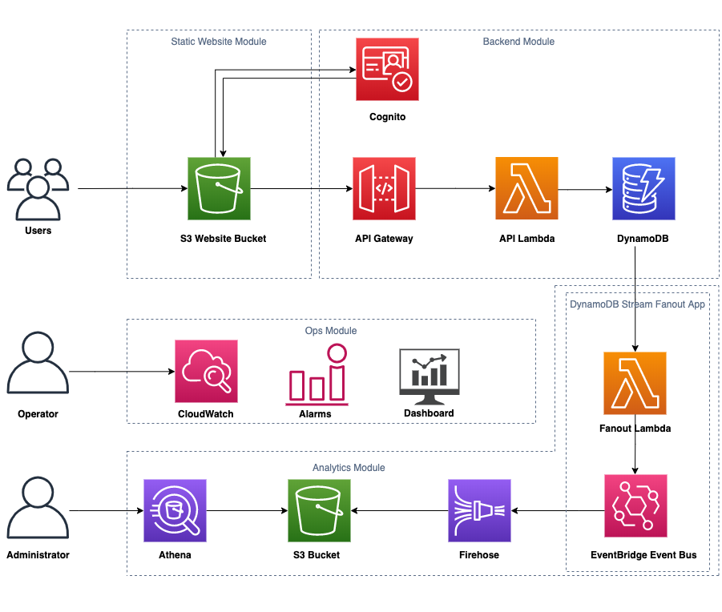

## realworld-serverless-application 

This project is an adaptation of the [AWS Serverless Application Repository](https://aws.amazon.com/serverless/serverlessrepo/). It's primary objective is to serve as a case study of how to build a production grade service using a combination of serverless technologies and approaches. The project captures key architectural components, code structure, deployment techniques, testing approaches, and operational practices of the AWS Serverless Application Repository - a production-grade AWS service, written in Java and built using serverless technologies. It is comprised of 4 components.

To get started, see the [Quickstart](https://github.com/awslabs/aws-serverless-app-repo-reference-implementation/wiki/Quick-Start) guide. For more details, see our documentation in the [Wiki](https://github.com/awslabs/aws-serverless-app-repo-reference-implementation/wiki) section of the GitHub repository.

For more information, here are some project level references:
1. [Overview]()(TODO: blog post link)
1. [Best Practices](https://github.com/awslabs/realworld-serverless-application/wiki/Best-Practices)

## License

This project is licensed under the Apache-2.0 License.
